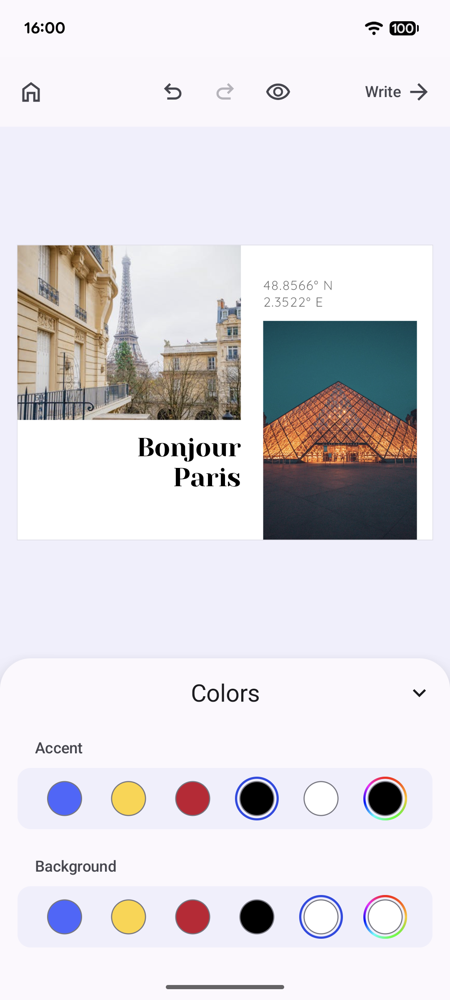

## Postcard Editor Starter Kit in Android

  

The starter kit is built on top of the Creative Editor SDK. 
Built to facilitate optimal post- & greeting- card design, from changing accent colors and selecting fonts to custom messages and pictures
Toggling from edit to preview mode allows reviewing the design in the context of the entire post/greeting card.
A floating action button at the bottom of the editor features only the most essential editing options in order of relevance allowing users to overlay text, add images, shapes, stickers and upload new image assets.

### Repository Structure

- Repository is a fully functional Android project with `:starter-kit` and `:app` modules.
- `:starter-kit` library module encapsulates the implementation of the starter kit. Starting point of the starter kit implementation is at `PostcardConfigurationBuilder.kt`.
- `:app` application module launches `EditorActivity.kt` that displays the `Editor` composable using `PostcardConfigurationBuilder`.

### Building The Repository

1. Clone the repository.
2. [Create and launch](https://developer.android.com/studio/run/managing-avds) a new android emulator or use an existing one. 
3. Open the local repository via `Android Studio` and click the `Run` button or go to the local repository via terminal and call `./gradlew installDebug`.

### Useful links

- [Starter Kit Documentation](https://img.ly/docs/cesdk/android/prebuilt-solutions/postcard-editor-61e1f6/)
- [CESDK Android Documentation](https://img.ly/docs/cesdk/android)
- [CESDK Android Source Code](https://github.com/imgly/cesdk-android)
- [CESDK Android Examples and Play Store App Code](https://github.com/imgly/cesdk-android-examples)
